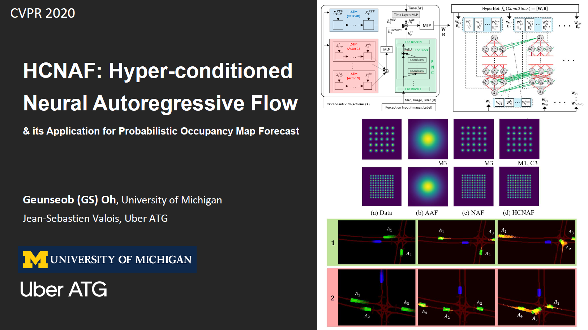

# HCNAF - Hyper-conditioned Neural Autoregressive Flow

<p align="center">

</p>

- Pytorch implementation of HCNAF by Geunseob (GS) Oh, Jean-Sebastien Valois
- [HCNAF - CVPR 2020 preprint](https://arxiv.org/abs/1912.08111)


## Requirements
- Python 3
- PyTorch
- NumPy


## HCNAF_Gaussians experiments
### Training
EXP: Gaussian 1
```
python train_hcnaf_gaussians.py --dataset gaussians_exp1 --batch_dim 64 --clip_gradnorm_max 1.0 --n_layers_flow 2 --dim_h_flow 64 --hypernet_layers 2 --norm_HW modified_weightnorm --patience 20
```

EXP: Gaussian 2
```
python train_hcnaf_gaussians.py --dataset gaussians_exp2 --batch_dim 4 --clip_gradnorm_max 0.1 --n_layers_flow 3 --dim_h_flow 200 --hypernet_layers 2 --norm_HW scaled_frobenius --patience 50
```

### Testing
Task: plot
```
python test_hcnaf_gaussians.py --task plot --loadpath $PATH_TO_MODEL_FOLDER --loadfilename $MODEL_FILENAME
```

Task: NLL computation
```
python test_hcnaf_gaussians.py --task NLL --loadpath $PATH_TO_MODEL_FOLDER --loadfilename $MODEL_FILENAME
```


## HCNAF_PRECOG_Carla experiments
- HCNAF models are trained & evaluated on [CARLA Town01 data](https://github.com/nrhine1/precog_carla_dataset)
- **NOTE**: The default path to the data folder is set to data/precog_carla/town1. Make sure to create data/precog_carla/town1 folder and that the town1 folder contains data folders named as "train", "val", "test".

### Training
Model: with lidar (a large model)
```
python train_PRECOG_Carla.py --dataset PRECOG_Carla --ablation_mode All_faster_temporal --batch_size 8 --n_layers_flow 3 --dim_h_flow 100 --norm_HW modified_weightnorm --loss PNLL_output --temporal 1
```

Model: with lidar (a small model)
```
python train_PRECOG_Carla.py --dataset PRECOG_Carla --ablation_mode All_faster_temporal --batch_size 4 --n_layers_flow 3 --dim_h_flow 20 --norm_HW scaled_frobenius --loss PNLL_output --temporal 1
```

Model: without lidar
```
python train_PRECOG_Carla.py --dataset PRECOG_Carla --ablation_mode No_lidar_faster_temporal --batch_size 4 --n_layers_flow 3 --dim_h_flow 100 --norm_HW modified_weightnorm --loss PNLL_output --temporal 1 --learning_rate 0.0002
```

### Testing
Task: plot
```
python test_PRECOG_Carla.py --task plot --loadpath $PATH_TO_MODEL_FOLDER --loadfilename $MODEL_FILENAME
```

Task: extra PNLL computation
```
python test_PRECOG_Carla.py --task extra_PNLL --loadpath $PATH_TO_MODEL_FOLDER --loadfilename $MODEL_FILENAME
```


## Citation (BibTeX)
```
@article{oh2019hcnaf,
  title={HCNAF: Hyper-Conditioned Neural Autoregressive Flow and its Application for Probabilistic Occupancy Map Forecasting},
  author={Oh, Geunseob and Valois, Jean-Sebastien},
  journal={arXiv},
  pages={arXiv--1912},
  year={2019}
}
```


## License

Licensed under the [Apache License 2.0](LICENSE)

